# Kleidungslager – Screenshot-Dokumentation

**Art der Arbeit:** Screenshot-Dokumentation  
**Projekt:** Kleidungslager  
**Vorgelegt von:** Ibrahim Danisman  
**Matrikelnummer:** 578949  
**Studiengang:** Wirtschaftsinformatik  
**Hochschule:** HTW Berlin  
**Datum:** 05.07.2026

> Für die PDF-Fassung ist die Deckblatt-Vorlage `C:\Users\ibrah\Downloads\Deckblatt_AA_Deutsch_01.pdf` vorgesehen. Die Screenshots in dieser Dokumentation wurden neu aus der laufenden Anwendung erzeugt.

---

## Kurze Projektbeschreibung

Das Projekt „Kleidungslager“ ist eine Webanwendung zur Verwaltung von Kleidungsstücken in einem Lagerbestand. Benutzer können sich im Frontend anmelden, Kleidungsstücke erfassen, anzeigen, suchen, filtern, sortieren, bearbeiten und löschen. Der Live-Bestand wird aus dem Backend geladen und zentrale CRUD-Funktionen sind über REST-Endpunkte angebunden. Zusätzlich bietet die Anwendung eine Detailseite, Barcode-/Artikelnummer-Funktionen, CSV-Export, Einstellungen und ein Impressum. Die folgenden Screenshots dokumentieren die sichtbare Umsetzung der wichtigsten Use-Cases.

## Use-Case-Übersicht

| Nr. | Use-Case | Sichtbarer Nachweis |
| --- | --- | --- |
| 1 | Anmelden | Login-Seite mit E-Mail, Passwort und Einloggen-Button |
| 2 | Dashboard und Lagerkennzahlen anzeigen | Kennzahlen, Nachbestellung, kritische Artikel |
| 3 | Neues Kleidungsstück erstellen | Eingabemaske mit Speichern-Button |
| 4 | Eingaben validieren | Sichtbare Fehlermeldungen im Formular |
| 5 | Live-Bestand anzeigen | Liste gespeicherter Kleidungsstücke |
| 6 | Suchen, filtern und sortieren | Suchfeld, Filter und Sortierung |
| 7 | Ansicht wechseln | Tabellenansicht der Bestandsliste |
| 8 | Barcode scannen oder Artikelnummer suchen | Scanner-Dialog und manuelle Barcode-Eingabe |
| 9 | Detailseite öffnen | Detailansicht eines Kleidungsstücks |
| 10 | Kleidungsstück bearbeiten | Bearbeitungsmodus mit editierbaren Feldern |
| 11 | Kleidungsstück löschen | Sichtbarer Löschen-Button |
| 12 | CSV exportieren | CSV-exportieren-Button im Dashboard |
| 13 | Einstellungen verwalten | Profil, Lagerregeln und Anzeigeoptionen |
| 14 | Impressum anzeigen | Kontaktdaten und Hochschulangaben |

---

## Use-Case 1: Anmelden

**Ziel:**  
Der Benutzer öffnet die Login-Seite und meldet sich für den geschützten Dashboard-Bereich an. Dafür stehen E-Mail-Feld, Passwort-Feld und Einloggen-Button bereit.

**Screenshot:**  
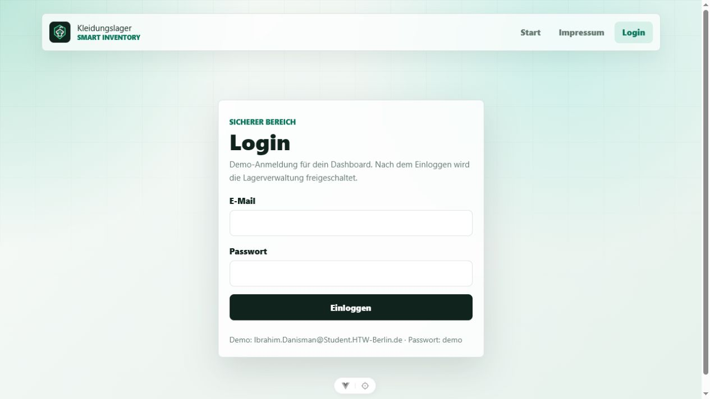

**Sichtbarer Nachweis:**

* Die Seite zeigt die Überschrift „Login“.
* E-Mail, Passwort und Einloggen-Button sind sichtbar.
* Der Screenshot belegt, dass ein Login-Bereich im Frontend umgesetzt ist.

**Umsetzung:**

* Frontend: `src/views/LoginView.vue`, `src/auth.ts`, `src/router/index.ts`

---

## Use-Case 2: Dashboard und Lagerkennzahlen anzeigen

**Ziel:**  
Der Benutzer erhält nach dem Login eine Übersicht über den Lagerzustand. Das Dashboard zeigt Kennzahlen wie Artikel, Gesamtbestand, Lagerplätze und niedrige Bestände.

**Screenshot:**  
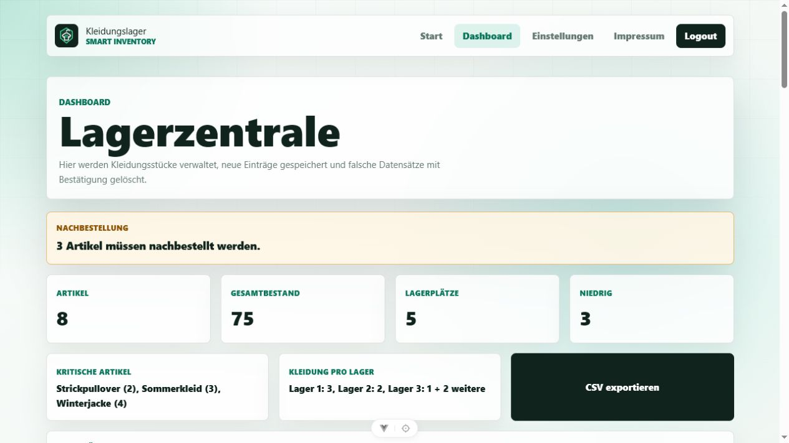

**Sichtbarer Nachweis:**

* Die Seite zeigt die Überschrift „Lagerzentrale“.
* Kennzahlen und Nachbestellhinweise sind sichtbar.
* Kritische Artikel und Kleidung pro Lager werden zusammengefasst angezeigt.

**Umsetzung:**

* Frontend: `src/views/DashboardView.vue`, `src/components/KleidungsListe.vue`

---

## Use-Case 3: Neues Kleidungsstück erstellen

**Ziel:**  
Der Benutzer kann ein neues Kleidungsstück über eine Eingabemaske erfassen. Dazu gehören Artikelnummer, Bezeichnung, Größe, Kategorie, Farbe, Lager, Bestand, Bild und Speichern-Button.

**Screenshot:**  
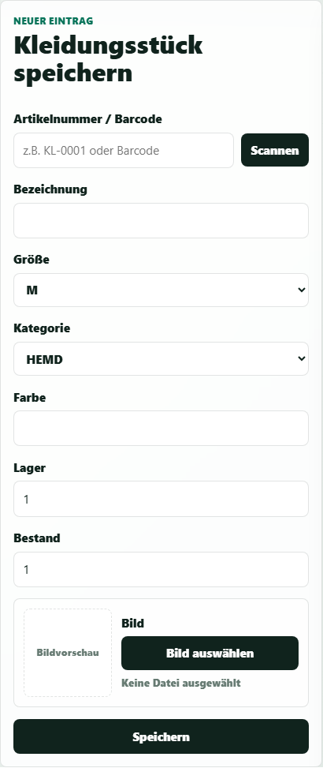

**Sichtbarer Nachweis:**

* Die Eingabemaske zeigt alle Pflichtfelder, Bildauswahl und Speichern-Button.
* Der Screenshot belegt, wo neue Datensätze im Frontend erstellt werden.

**Umsetzung:**

* Frontend: `src/components/KleidungsListe.vue`
* Backend: `POST /api/kleidung`

---

## Use-Case 4: Eingaben validieren

**Ziel:**  
Ungültige oder fehlende Eingaben sollen erkannt werden. Der Benutzer erhält sichtbare Hinweise, welche Formularfelder korrigiert werden müssen.

**Screenshot:**  
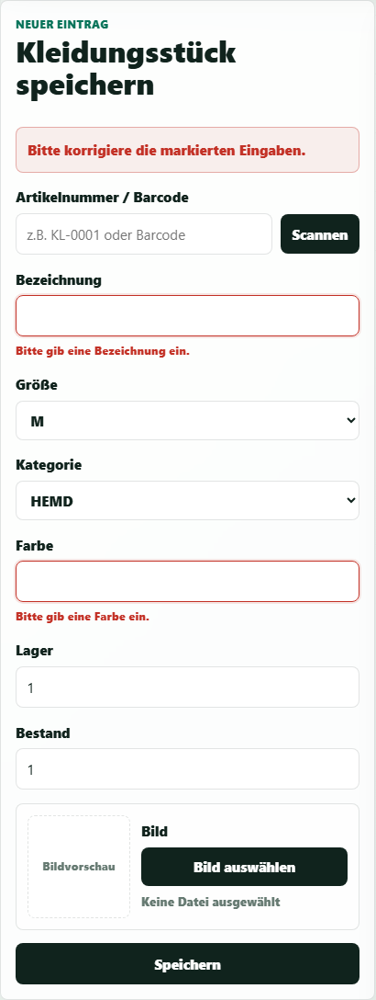

**Sichtbarer Nachweis:**

* Das Formular zeigt die Meldung „Bitte korrigiere die markierten Eingaben“.
* Bei Bezeichnung und Farbe sind konkrete Fehlermeldungen sichtbar.

**Umsetzung:**

* Frontend: `src/formularValidierung.ts`, `src/components/KleidungsListe.vue`
* Backend: Bean Validation / `ApiExceptionHandler`

---

## Use-Case 5: Live-Bestand anzeigen

**Ziel:**  
Der Benutzer sieht gespeicherte Kleidungsstücke direkt im Live-Bestand. Die Liste zeigt pro Eintrag zentrale Informationen wie Name, Kategorie, Größe, Farbe, Lager und Bestand.

**Screenshot:**  
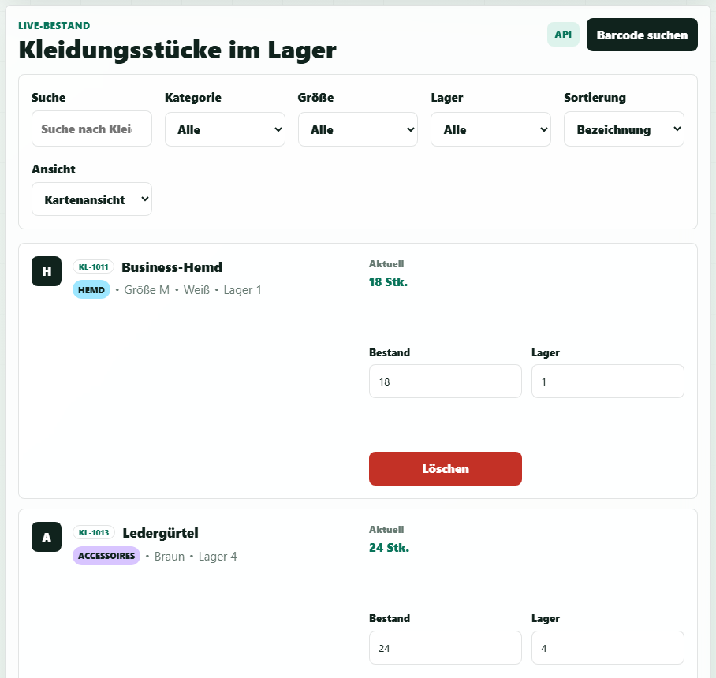

**Sichtbarer Nachweis:**

* Mehrere Kleidungsstücke werden in der Liste angezeigt.
* Bestand und Lager sind direkt sichtbar.

**Umsetzung:**

* Frontend: `src/components/KleidungsListe.vue`
* Backend: `GET /api/kleidung`

---

## Use-Case 6: Suchen, filtern und sortieren

**Ziel:**  
Der Benutzer kann den Bestand gezielt durchsuchen und einschränken. Suchfeld, Kategorie-Filter, Größen-Filter, Lager-Filter und Sortierung unterstützen die schnelle Orientierung.

**Screenshot:**  
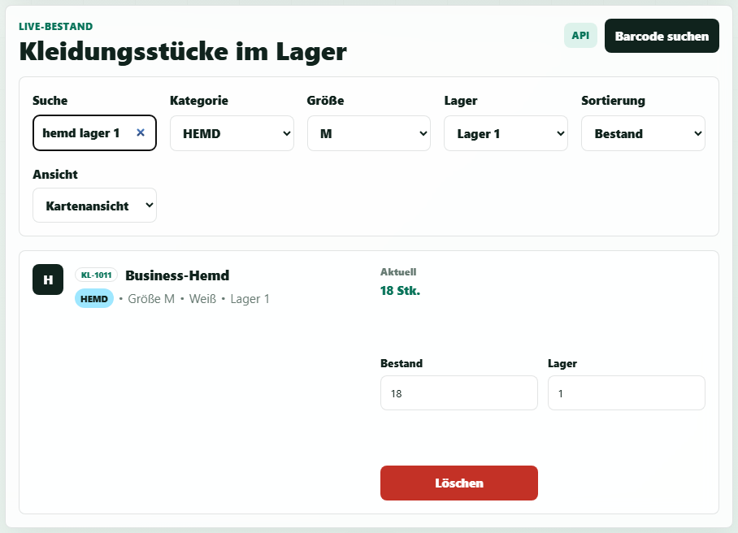

**Sichtbarer Nachweis:**

* Das Suchfeld enthält mehrere Suchbegriffe.
* Kategorie, Größe, Lager und Sortierung sind als Auswahlfelder sichtbar.
* Die gefilterte Liste zeigt nur passende Einträge.

**Umsetzung:**

* Frontend: `src/components/KleidungsListe.vue`

---

## Use-Case 7: Ansicht wechseln

**Ziel:**  
Der Benutzer kann die Darstellung des Bestands wechseln. Neben der Kartenansicht ist auch eine Tabellenansicht vorhanden.

**Screenshot:**  
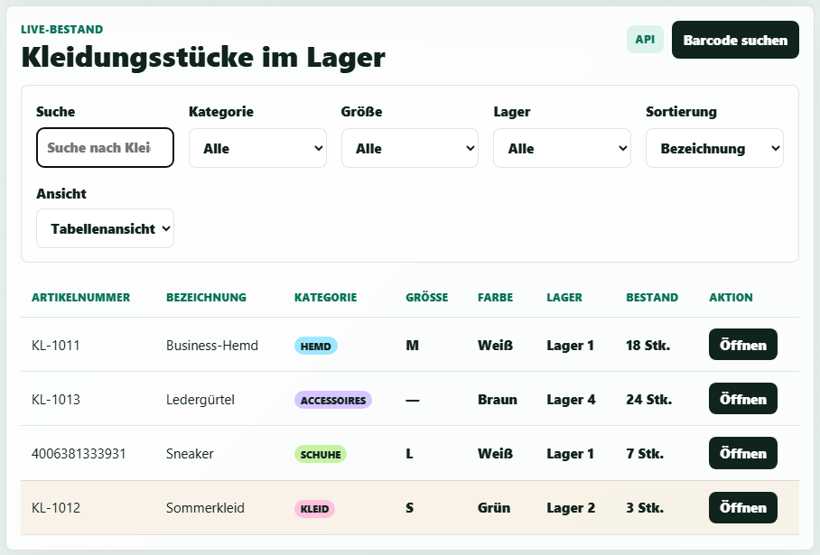

**Sichtbarer Nachweis:**

* Das Feld „Ansicht“ steht auf Tabellenansicht.
* Die Bestandsdaten werden tabellarisch angezeigt.
* Die Tabelle enthält Artikelnummer, Bezeichnung, Kategorie, Größe, Farbe, Lager und Bestand.

**Umsetzung:**

* Frontend: `src/components/KleidungsListe.vue`

---

## Use-Case 8: Barcode scannen oder Artikelnummer suchen

**Ziel:**  
Der Benutzer kann einen Barcode scannen oder manuell eingeben. Die manuelle Eingabe dient als Fallback, falls die Kamera nicht geöffnet werden kann.

**Screenshot:**  
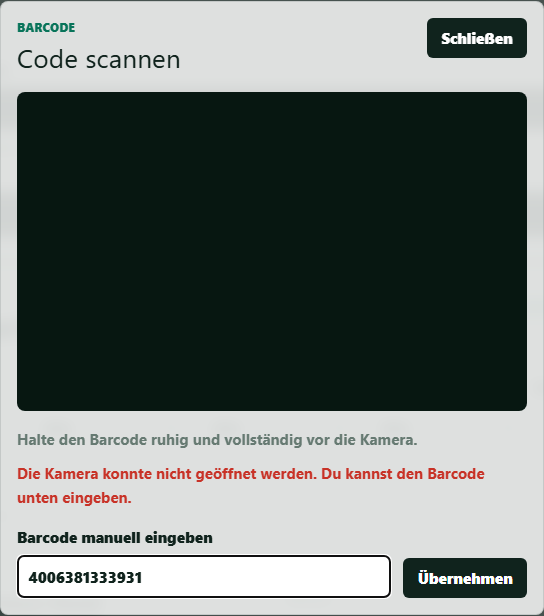

**Sichtbarer Nachweis:**

* Der Dialog „Code scannen“ ist sichtbar.
* Die manuelle Barcode-Eingabe enthält einen gültigen Beispielcode.
* Der Hinweis zur Kamera zeigt, dass ein Fallback für die manuelle Eingabe vorhanden ist.

**Umsetzung:**

* Frontend: `src/components/BarcodeScanner.vue`, `src/barcode.ts`
* Backend: `GET /api/kleidung/artikelnummer/{artikelnummer}`

---

## Use-Case 9: Detailseite eines Kleidungsstücks öffnen

**Ziel:**  
Der Benutzer kann die Detailseite eines Kleidungsstücks öffnen. Dort werden Bild, Artikelnummer, Bezeichnung, Kategorie, Größe, Farbe, Lager und Bestand gebündelt dargestellt.

**Screenshot:**  
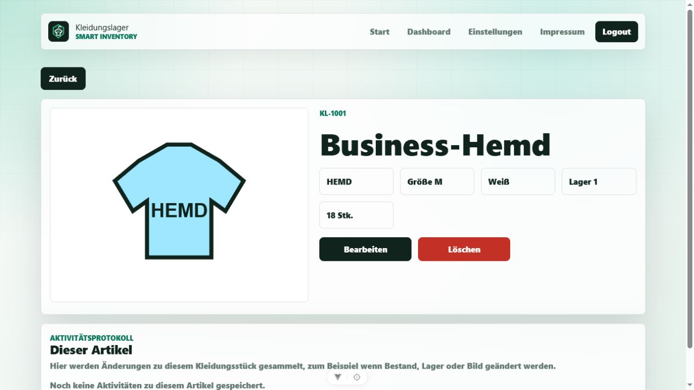

**Sichtbarer Nachweis:**

* Die Detailseite zeigt ein konkretes Kleidungsstück.
* Bild und Stammdaten werden gemeinsam angezeigt.
* Die Detailseite besitzt eigene Aktionen für Bearbeiten und Löschen.

**Umsetzung:**

* Frontend: `src/views/KleidungsDetailView.vue`

---

## Use-Case 10: Kleidungsstück bearbeiten

**Ziel:**  
Der Benutzer kann Daten eines Kleidungsstücks bearbeiten. Im Bearbeitungsmodus werden die Felder editierbar und Änderungen können aktualisiert werden.

**Screenshot:**  
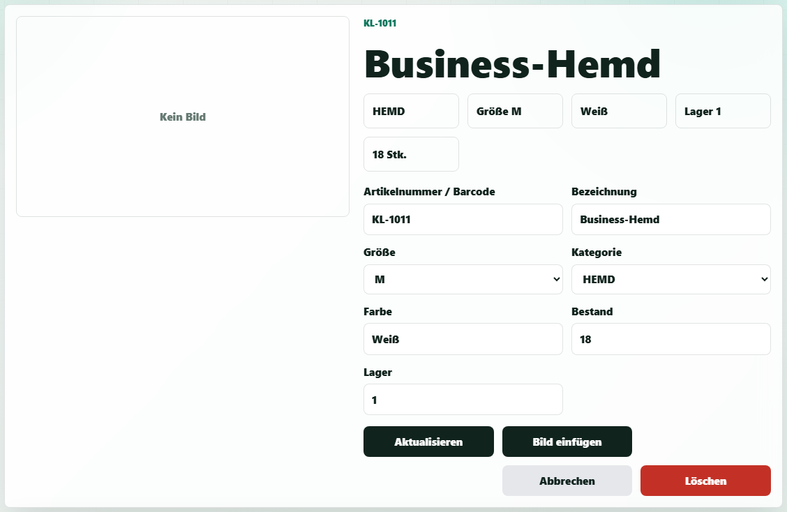

**Sichtbarer Nachweis:**

* Artikelnummer, Bezeichnung, Größe, Kategorie, Farbe, Bestand und Lager sind editierbar.
* Der Aktualisieren-Button ist sichtbar.
* Bild ändern, Bild entfernen, Abbrechen und Löschen sind als Aktionen vorhanden.

**Umsetzung:**

* Frontend: `src/views/KleidungsDetailView.vue`
* Backend: `PUT /api/kleidung/{id}/bestand`

---

## Use-Case 11: Kleidungsstück löschen

**Ziel:**  
Der Benutzer kann ein Kleidungsstück aus dem Bestand entfernen. Die Löschfunktion ist als deutlich sichtbare Aktion dargestellt.

**Screenshot:**  

**Sichtbarer Nachweis:**

* Auf der Detailseite ist ein roter Löschen-Button sichtbar.
* Der Button ist dem geöffneten Kleidungsstück zugeordnet.
* Der Screenshot zeigt, wo der Benutzer den Löschvorgang auslösen kann.

**Umsetzung:**

* Frontend: `src/views/KleidungsDetailView.vue`, `src/components/KleidungsListe.vue`
* Backend: `DELETE /api/kleidung/{id}`

---

## Use-Case 12: CSV exportieren

**Ziel:**  
Der Benutzer kann die Lagerliste als CSV-Datei exportieren. Diese Funktion unterstützt die Weiterverarbeitung der Daten außerhalb der Anwendung.

**Screenshot:**  

**Sichtbarer Nachweis:**

* Der Button „CSV exportieren“ ist im Dashboard sichtbar.
* Die Funktion befindet sich neben den Lagerauswertungen.
* Der Screenshot zeigt, wo der Export ausgelöst wird.

**Umsetzung:**

* Frontend: `src/components/KleidungsListe.vue`

---

## Use-Case 13: Einstellungen verwalten

**Ziel:**  
Der Benutzer kann Einstellungen für Konto und Dashboard ändern. Dazu gehören Profilwerte, Schwellenwert für niedrigen Bestand, Standardsortierung, API-Hinweis, Kompaktansicht und Dunkelmodus.

**Screenshot:**  
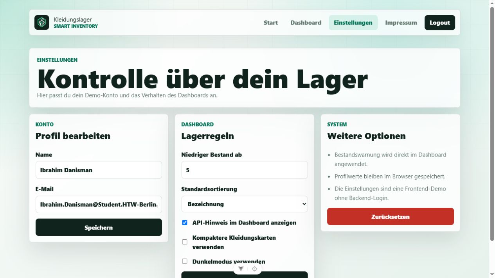

**Sichtbarer Nachweis:**

* Profil bearbeiten, Lagerregeln und weitere Optionen sind sichtbar.
* Der Schwellenwert „Niedriger Bestand ab“ kann angepasst werden.
* Mehrere Anzeigeoptionen sind als Checkboxen umgesetzt.

**Umsetzung:**

* Frontend: `src/views/SettingsView.vue`, `src/settings.ts`

---

## Use-Case 14: Impressum anzeigen

**Ziel:**  
Der Benutzer kann das Impressum öffnen. Dort stehen Name, Matrikelnummer, E-Mail und Hochschule.

**Screenshot:**  
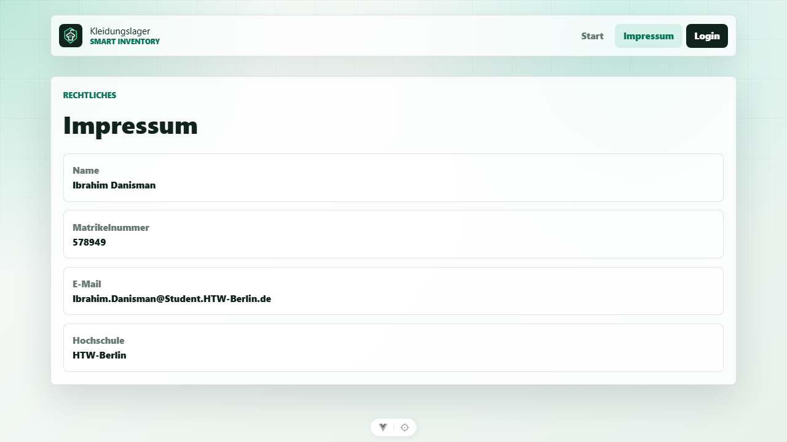

**Sichtbarer Nachweis:**

* Die Seite zeigt die Überschrift „Impressum“.
* Name, Matrikelnummer, E-Mail und Hochschule sind sichtbar.
* Der Screenshot belegt, dass eine eigene Impressumsseite im Frontend vorhanden ist.

**Umsetzung:**

* Frontend: `src/views/ImpressumView.vue`

---

## Kurzes Fazit

Die Anwendung deckt die wichtigsten Use-Cases einer Kleidungslagerverwaltung ab. Die Screenshots zeigen, dass die Funktionen sichtbar im Frontend umgesetzt sind. Zentrale CRUD-Funktionen sind mit dem Backend verbunden und nutzen REST-Endpunkte. Ergänzende Funktionen wie Barcode-Eingabe, CSV-Export, Einstellungen und Impressum sind im Frontend nachvollziehbar umgesetzt. Die Dokumentation konzentriert sich bewusst auf den sichtbaren Umsetzungsnachweis der einzelnen Use-Cases.
